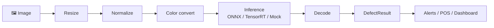

# Defect Detection Pipeline (Example Project)

**Example project:** defect detection pipeline for shopping items — **C++23**, **OpenCV**, edge-friendly, modular.

Detects wrong item, wrong quantity, quality/expiry, and process errors (e.g. not scanned) in retail images. The pipeline is designed for **edge deployment** (e.g. at POS or in-store) with configurable stages: preprocessing (resize, normalize, color convert), pluggable inference (ONNX / TensorRT / Mock), and decoding to structured **DefectResult**. This is an **independent example** for retail/edge AI use cases; no company names, brands, or products are used with permission or endorsement.

---

## Pipeline workflow



| Step | What it does |
|------|----------------|
| **Image** | Input: one frame from camera, file, or stream (width, height, pixel format). |
| **Resize** | Scale to the model’s input size (e.g. 640×640) so every frame has the same dimensions. |
| **Normalize** | Map pixel values to the range the model expects (e.g. 0–1 or mean/scale). |
| **Color convert** | Change format if needed (e.g. BGR→RGB) to match the model’s expected layout. |
| **Inference** | Run the ML model (ONNX Runtime, TensorRT, or Mock in tests) on the preprocessed frame; output is raw detections (boxes, scores, class IDs). |
| **Decode** | Turn raw model output into **defects**: apply confidence threshold, NMS, and map class IDs to defect kinds (wrong item, wrong quantity, expiry/quality, process error). |
| **DefectResult** | Structured result for this frame: `frame_id` and a list of **Defect** (kind, bbox, confidence, optional product/category). |
| **Alerts / POS / Dashboard** | Application layer uses the result: log, send to POS, show on a dashboard, or trigger alerts. |

Batches of frames can run in parallel via `run_pipeline_batch_parallel`. More diagrams: [docs/workflow.md](docs/workflow.md).

---

## Quick start

**Option A — Docker (no Conan/OpenCV on your machine):**

```bash
./scripts/docker_nomitri.sh              # install deps + build (builds image first if needed)
./build/apps/normitri-cli/normitri_cli --help
./scripts/docker_nomitri.sh test         # run tests
./scripts/docker_nomitri.sh run --help   # run CLI inside container
./scripts/docker_nomitri.sh shell        # bash inside container
```

**Option B — Host build (install Conan first: `pip install conan`):**

```bash
./scripts/build_nomitri.sh install   # Install OpenCV + GTest (Conan)
./scripts/build_nomitri.sh build    # Configure and build
./build/apps/normitri-cli/normitri_cli --help
ctest --test-dir build
```

Or one step: `./scripts/build_nomitri.sh all`. On Windows use Git Bash or WSL for the script; for Docker use WSL or Docker Desktop.

---

## Project organization

| Path | Description |
|------|-------------|
| **include/normitri/** | Public API: **core** (Frame, Defect, DefectResult, Pipeline, stages), **vision** (resize, normalize, color convert, defect decoder, inference backend interface), **app** (config, pipeline runner). |
| **src/** | Implementation (`.cpp`) for core, vision, and app; dependencies flow **app → vision → core** (core has no external deps). |
| **apps/normitri-cli/** | CLI executable: run the pipeline on image(s), output defects (and optional JSON). |
| **tests/** | **Unit tests** (core: frame, defect, pipeline; vision: defect decoder, mock backend) and **integration** (full pipeline). Uses GTest; run with `ctest --test-dir build`. |
| **cmake/** | CMake helpers: `CompilerWarnings.cmake` (warnings-as-errors option), `NormitriConfig.cmake.in` for install/`find_package`. |
| **scripts/** | `build_nomitri.sh` (Conan install + CMake build), `docker_nomitri.sh` (build and run inside Docker). |
| **docs/** | Architecture, building, workflow diagrams, API reference, detection efficiency, dependencies, inference contract, quality/maturity, issue log. See [Documentation](#documentation) below. |
| **.github/workflows/** | Trigger-based CI/CD: CI (GCC/Clang build + test), Docker (build and test in container), Format (clang-format), CodeQL, Release (artifacts). See [.github/workflows/README.md](.github/workflows/README.md). |

---

## Documentation

| Document | Description |
|----------|-------------|
| [**docs/README.md**](docs/README.md) | Documentation index, project aim, quick links. |
| [**Workflow**](docs/workflow.md) | Pipeline diagrams (single-frame, batch, parallel). |
| [**Architecture**](docs/architecture.md) | High-level design, layers (core → vision → app), pipeline stages, adding stages. |
| [**Building**](docs/building.md) | CMake, Conan, Docker, options, CI, releases. |
| [**Development**](docs/development.md) | Coding standards, module contents, testing. |
| [**API Reference**](docs/api-reference.md) | Core types (Frame, Defect, DefectResult) and pipeline interfaces. |
| [**Detection efficiency**](docs/detection-efficiency.md) | Design considerations: detection by item type/category/price. |
| [**Dependencies**](docs/dependencies.md) | Why OpenCV, why we don’t vendor it. |
| [**Inference contract**](docs/inference-contract.md) | Input format/layout expected by inference backends. |
| [**Inference design & gaps**](docs/inference-design-and-gaps.md) | Backend interface, batching, future work. |
| [**Quality & maturity**](docs/quality-and-maturity.md) | What’s strong today and what would make it “world class”. |
| [**Company & aim**](docs/company-and-aim.md) | Example domain context (defect detection in retail). |
| [**docs/issues/logs.md**](docs/issues/logs.md) | Build and Docker issue log (CRLF, Conan, OpenCV, toolchain, etc.). |

---

## Requirements

- **C++23** (GCC 13+, Clang 16+, MSVC 2022 17.6+)
- **CMake** 3.21+
- **OpenCV** (required for vision stages). Provide via [Conan](https://conan.io) or system packages.
- **GTest** (required for building tests). Provide via Conan or system packages (e.g. `libgtest-dev`). See [docs/building.md](docs/building.md).

---

## License

This project is licensed under the GNU Affero General Public License v3.0 (AGPL-3.0). See [LICENSE](LICENSE).
