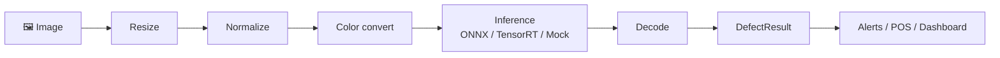

# Defect Detection Pipeline (Example Project)

**Example project:** defect detection pipeline for shopping items — **C++23**, **OpenCV**, edge-friendly, modular.

Detects wrong item, wrong quantity, quality/expiry, and process errors (e.g. not scanned) in retail images. The pipeline is designed for **edge deployment** (e.g. at POS or in-store) with configurable stages: preprocessing (resize, normalize, color convert), pluggable inference (ONNX / TensorRT / Mock), and decoding to structured **DefectResult**. This is an **independent example** for retail/edge AI use cases; no company names, brands, or products are used with permission or endorsement.

---

## Pipeline workflow



| Step | What it does |
|------|----------------|
| **Image** | Input: one frame from camera, file, or stream (width, height, pixel format). |
| **Resize** | Scale to the model’s input size (e.g. 640×640) so every frame has the same dimensions. |
| **Normalize** | Map pixel values to the range the model expects (e.g. 0–1 or mean/scale). |
| **Color convert** | Change format if needed (e.g. BGR→RGB) to match the model’s expected layout. |
| **Inference** | Run the ML model (ONNX Runtime, TensorRT, or Mock in tests) on the preprocessed frame; output is raw detections (boxes, scores, class IDs). |
| **Decode** | Turn raw model output into **defects**: apply confidence threshold, NMS, and map class IDs to defect kinds (wrong item, wrong quantity, expiry/quality, process error). |
| **DefectResult** | Structured result for this frame: `frame_id`, list of **Defect** (kind, bbox, confidence, optional product/category), and optional **camera_id** / **customer_id** for traceability (which camera, which customer). |
| **Alerts / POS / Dashboard** | Application layer uses the result: log, send to POS, show on a dashboard, or trigger alerts. |

Batches of frames can run in parallel via `run_pipeline_batch_parallel`. More diagrams: [docs/workflow.md](docs/workflow.md).

**Inference backends:** The pipeline supports a **mock** backend (synthetic defects for tests/demo) and an **ONNX** backend (real model inference). Default is **mock**; use a config file or `--backend onnx --model <path>` to run with a real detection model (e.g. one “WrongItem”). See [Choosing the backend](#choosing-the-backend) below. TensorRT is planned for a later phase ([Implementation plan](docs/implementation_plan.md)).

---

## Quick start

**Option A — Docker (no Conan/OpenCV on your machine):**

```bash
./scripts/docker_nomitri.sh              # install deps + build (builds image first if needed)
./scripts/download_sample_images.sh      # one-time: fetch data/images/sample_shelf.jpg (required for --input)
./scripts/download_onnx_models.sh         # optional: fetch ONNX model to models/onnx-community__yolov10n/onnx/model.onnx
./scripts/docker_nomitri.sh run --help   # run CLI inside container (lists --config, --backend, --model, --input)
./scripts/docker_nomitri.sh run --input data/images/sample_shelf.jpg   # mock backend; writes output/sample_shelf.txt
./scripts/docker_nomitri.sh test         # run tests
./scripts/docker_nomitri.sh shell        # bash inside container
```

**Option B — Host build (install Conan first: `pip install conan`):**

```bash
./scripts/build_nomitri.sh install   # Install OpenCV + GTest (Conan)
./scripts/build_nomitri.sh build    # Configure and build
./build/apps/normitri-cli/normitri_cli --help
./build/apps/normitri-cli/normitri_cli --input data/images/sample_shelf.jpg   # run on image (mock); writes output/sample_shelf.txt
ctest --test-dir build
```

Or one step: `./scripts/build_nomitri.sh all`. On Windows use Git Bash or WSL for the script; for Docker use WSL or Docker Desktop. With `--input`, the CLI also writes results to `output/<basename>.txt`.

---

## Choosing the backend

| Backend | When to use | How to select |
|--------|--------------|----------------|
| **mock** | Tests, demo, CI (no model file). | Default if no config; or `--backend mock` or config `backend_type=mock`. |
| **onnx** | Real defect detection with an ONNX model. | Config: `backend_type=onnx` and `model_path=/path/to/model.onnx`; or CLI: `--backend onnx --model /path/to/model.onnx`. |
| **tensorrt** | (Planned) GPU-optimized inference. | Will use `backend_type=tensorrt` / `--backend tensorrt` and engine path. |

**Examples:**

```bash
# Mock (default) — no model needed
./scripts/docker_nomitri.sh run --input data/images/sample_shelf.jpg

# ONNX — use path to your .onnx file (after ./scripts/download_onnx_models.sh: model is at models/onnx-community__yolov10n/onnx/model.onnx)
./scripts/docker_nomitri.sh run --backend onnx --model /src/models/onnx-community__yolov10n/onnx/model.onnx --input data/images/sample_shelf.jpg

# Config file — put backend_type=onnx and model_path=... in a file, then:
./scripts/docker_nomitri.sh run --config config/onnx.txt --input data/images/sample_shelf.jpg
```

**Where to put ONNX files:** Use any path you like; pass it via `model_path` in config or `--model` on the CLI. A common choice is a **`models/`** directory (e.g. `models/detector.onnx`); run the CLI from the repo root or use an absolute path. You can have many ONNX files (e.g. one per customer); each pipeline uses one model at a time — see [Implementation plan — Models](docs/implementation_plan.md#phase-1-onnx-runtime-backend-cpu-first).

See [Implementation plan — Config and CLI](docs/implementation_plan.md#phase-1-onnx-runtime-backend-cpu-first) for config file format and [Inference contract](docs/inference-contract.md) for expected input format.

---

## Project organization

| Path | Description |
|------|-------------|
| **include/normitri/** | Public API: **core** (Frame, Defect, DefectResult, Pipeline, stages), **vision** (resize, normalize, color convert, defect decoder, inference backend interface, mock and ONNX backends), **app** (config, pipeline runner). |
| **src/** | Implementation (`.cpp`) for core, vision, and app; dependencies flow **app → vision → core** (core has no external deps). |
| **apps/normitri-cli/** | CLI executable: run the pipeline on image(s), output defects (and optional JSON). |
| **tests/** | **Unit tests** (core: frame, defect, pipeline; vision: defect decoder, mock backend) and **integration** (full pipeline). Uses GTest; run with `ctest --test-dir build`. |
| **cmake/** | CMake helpers: `CompilerWarnings.cmake` (warnings-as-errors option), `NormitriConfig.cmake.in` for install/`find_package`. |
| **scripts/** | `build_nomitri.sh` (Conan install + CMake build), `docker_nomitri.sh` (build and run inside Docker). |
| **docs/** | Architecture, building, workflow diagrams, API reference, detection efficiency, dependencies, inference contract, quality/maturity, issue log. See [Documentation](#documentation) below. |
| **.github/workflows/** | Trigger-based CI/CD: CI (GCC/Clang build + test), Docker (build and test in container), Format (clang-format), CodeQL, Release (artifacts). See [.github/workflows/README.md](.github/workflows/README.md). |

---

## Documentation

| Document | Description |
|----------|-------------|
| [**docs/README.md**](docs/README.md) | Documentation index, project aim, quick links. |
| [**Preprocessing**](docs/preprocessing.md) | OpenCV-based stages; inference contract; future (ISPs, GPU). |
| [**Workflow**](docs/workflow.md) | Pipeline diagrams (single-frame, batch, parallel). |
| [**Architecture**](docs/architecture.md) | High-level design, layers (core → vision → app), pipeline stages, adding stages. |
| [**Building**](docs/building.md) | CMake, Conan, Docker, options, CI, releases. |
| [**Local CI testing (act)**](docs/act-local-testing.md) | Run GitHub Actions workflows locally with act before pushing. |
| [**Development**](docs/development.md) | Coding standards, module contents, testing. |
| [**API Reference**](docs/api-reference.md) | Core types (Frame, Defect, DefectResult) and pipeline interfaces. |
| [**Detection efficiency**](docs/detection-efficiency.md) | Design considerations: detection by item type/category/price. |
| [**Dependencies**](docs/dependencies.md) | Why OpenCV, why we don’t vendor it. |
| [**Inference contract**](docs/inference-contract.md) | Input format/layout expected by inference backends. |
| [**Inference details**](docs/inference-details.md) | ONNX format vs runtime, who trains models, TensorRT vs ONNX Runtime. |
| [**Threading and memory management**](docs/threading-and-memory-management.md) | RAII, ownership, pipeline and backend thread safety. |
| [**Inference design & gaps**](docs/inference-design-and-gaps.md) | Backend interface, batching, future work. |
| [**Quality & maturity**](docs/quality-and-maturity.md) | What’s strong today and what would make it “world class”. |
| [**Company & aim**](docs/company-and-aim.md) | Example domain context (defect detection in retail). |
| [**docs/issues/logs.md**](docs/issues/logs.md) | Build and Docker issue log (CRLF, Conan, OpenCV, toolchain, etc.). |

---

## Requirements

- **C++23** (GCC 13+, Clang 16+, MSVC 2022 17.6+)
- **CMake** 3.21+
- **OpenCV** (required for vision stages). Provide via [Conan](https://conan.io) or system packages.
- **ONNX Runtime** (required for ONNX backend). Provided via Conan when building; mock backend has no extra deps.
- **GTest** (required for building tests). Provide via Conan or system packages (e.g. `libgtest-dev`). See [docs/building.md](docs/building.md).

---

## License

This project is licensed under the GNU Affero General Public License v3.0 (AGPL-3.0). See [LICENSE](LICENSE).
