# Pipeline Workflow

Visual overview of the defect-detection pipeline. Use this for quick orientation and presentations.

PNG versions of these diagrams can be generated from the [flowchart_images](flowchart_images/) Mermaid sources (`.mmd`); run `python scripts/convert_mermaid_to_png.py docs/flowchart_images/ --all` (requires `@mermaid-js/mermaid-cli`).

## Single-frame pipeline

```mermaid
flowchart LR
    subgraph Input[" "]
        Img["🖼️ Image / Frame<br/>Camera, File, Stream"]
    end

    subgraph Preprocess["Preprocessing"]
        Resize["📐 Resize<br/>Model input size"]
        Normalize["📊 Normalize<br/>e.g. 0–1"]
        Color["🎨 Color Convert<br/>e.g. BGR→RGB"]
    end

    subgraph Inference["Inference"]
        Backend["⚡ Inference Backend<br/>ONNX / TensorRT / Mock"]
        Decode["🔍 Defect Decoder<br/>Thresholds, NMS"]
    end

    subgraph Output[" "]
        Result["✅ DefectResult<br/>frame_id, defects"]
        Alert["📢 Alerts / POS / Dashboard"]
    end

    Img --> Resize --> Normalize --> Color --> Backend --> Decode --> Result --> Alert
```

## End-to-end flow (with layers)

```mermaid
flowchart TD
    subgraph Sources["Input sources"]
        Cam["📷 Camera"]
        File["📁 Image file"]
        Stream["📡 Stream"]
    end

    Sources --> Frame["Frame<br/>width, height, format, buffer"]

    Frame --> Resize["ResizeStage<br/>📐 Target size"]
    Resize --> Normalize["NormalizeStage<br/>📊 Mean/scale"]
    Normalize --> ColorConvert["ColorConvertStage<br/>🎨 Format for model"]
    ColorConvert --> DefectStage["DefectDetectionStage"]

    subgraph DefectStage["DefectDetectionStage"]
        Validate["validate_input()"]
        Infer["infer() / infer_batch()"]
        Decode["DefectDecoder"]
    end

    Validate --> Infer --> Decode

    Decode --> DefectResult["DefectResult<br/>frame_id, defects[]"]

    DefectResult --> App["Application layer"]
    App --> Log["Log / Store"]
    App --> Alert["Alert / POS"]
    App --> Report["Report / Dashboard"]

    classDef input fill:#e3f2fd,stroke:#1565c0
    classDef process fill:#f3e5f5,stroke:#7b1fa2
    classDef output fill:#e8f5e9,stroke:#2e7d32
    class Frame,Resize,Normalize,ColorConvert input
    class Validate,Infer,Decode,DefectStage process
    class DefectResult,Log,Alert,Report output
```

## Batch & parallel execution

Two ways to handle many frames:

- **Frame-level (below):** One shared pipeline, one queue of frames. Use `run_pipeline_batch` (sequential) or `run_pipeline_batch_parallel` (thread pool). All workers share the same backend; backend must be thread-safe or use a single worker.
- **Customer / camera-level (recommended for many cameras):** One pipeline (and one inference backend) per customer or per camera. Route frames by `camera_id`/`customer_id`; run each pipeline from one thread. See [Threading and memory management](threading-and-memory-management.md#customer-level-or-camera-level-parallelism-recommended-for-production).

### Frame-level: shared pipeline

```mermaid
flowchart TD
    Frames["📦 Batch of Frames<br/>(single shared queue)"]
    Frames --> Choice{"Run mode?"}

    Choice -->|Sequential| Seq["run_pipeline_batch<br/>One frame after another"]
    Choice -->|Parallel| Par["run_pipeline_batch_parallel<br/>Thread pool, N workers"]

    Seq --> Run1["Pipeline::run(frame₁)"]
    Seq --> Run2["Pipeline::run(frame₂)"]
    Seq --> RunN["Pipeline::run(frameₙ)"]

    Par --> Pool["Worker 1 … Worker N"]
    Pool --> RunP1["Pipeline::run(frame)"]
    Pool --> RunP2["Pipeline::run(frame)"]

    Run1 --> CB["Callback(DefectResult)"]
    Run2 --> CB
    RunN --> CB
    RunP1 --> CB
    RunP2 --> CB

    CB --> Out["Collect / Alert / Store"]
```

### Customer / camera-level: one pipeline per unit (recommended for production)

```mermaid
flowchart TD
    subgraph Sources["Input sources"]
        Cam1["📷 Camera 1"]
        Cam2["📷 Camera 2"]
        CamN["📷 Camera N"]
    end

    subgraph Routing["Application: route by camera_id"]
        R1["Pipeline₁"]
        R2["Pipeline₂"]
        RN["Pipelineₙ"]
    end

    Cam1 --> R1
    Cam2 --> R2
    CamN --> RN

    R1 --> Run1["run_pipeline(Pipeline₁, frame)"]
    R2 --> Run2["run_pipeline(Pipeline₂, frame)"]
    RN --> RunN["run_pipeline(Pipelineₙ, frame)"]

    Run1 --> CB1["Callback(DefectResult)<br/>+ camera_id"]
    Run2 --> CB2["Callback(DefectResult)<br/>+ camera_id"]
    RunN --> CBN["Callback(DefectResult)<br/>+ camera_id"]

    CB1 --> Out["Collect / Alert / Store"]
    CB2 --> Out
    CBN --> Out

    note["Each pipeline used from one thread.<br/>No shared backend; scales by adding pipelines."]
```

## Where to extend

| Extension point | What to add |
|-----------------|-------------|
| **Image source** | New input (camera, MQTT, etc.) → produce `Frame` |
| **Preprocessing** | New stage implementing `IPipelineStage` (e.g. crop, augment) |
| **Inference** | New backend implementing `IInferenceBackend` (e.g. ONNX Runtime) |
| **Output** | New consumer of `DefectResult` (e.g. REST API, metrics) |

See [Architecture](architecture.md) and [API Reference](api-reference.md) for details.
